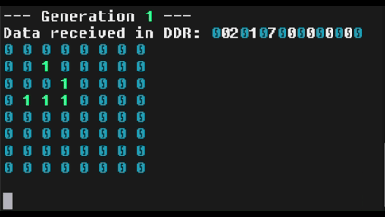
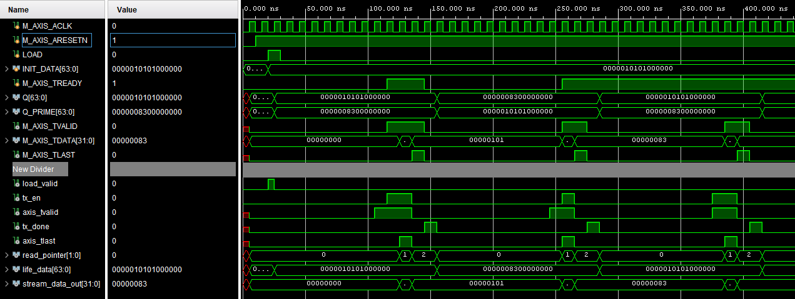

# Conway's Game of Life FPGA Implementation

## Overview

Conway's Game of Life is a deterministic cellular automaton governed by a few simple rules. This project implements the Game of Life in hardware on an FPGA, achieving significant performance improvements over software implementations.

## The Rules of Conway's Game of Life

The Game of Life operates according to four fundamental rules:

1. **Underpopulation**: Any live cell with fewer than two live neighbors dies
2. **Survival**: Any live cell with two or three live neighbors lives on to the next generation
3. **Overpopulation**: Any live cell with more than three live neighbors dies
4. **Reproduction**: Any dead cell with exactly three live neighbors becomes a live cell

## Performance Comparison: Software vs Hardware

### Software Implementation
- **Time Complexity**: O(M × N) where M and N are the grid dimensions
- Each generation requires processing every cell sequentially

### Hardware Implementation (FPGA)
- **Time Complexity**: O(1) for every new generation
- **Benefits**:
  - Dramatically faster calculations
  - Reduced power consumption
  - Parallel processing of all cells simultaneously

## Custom AXIS Protocol Implementation

### Communication Challenge
The hardware generation speed far exceeds the computer's processing capability, requiring a custom communication protocol to manage data flow effectively.

### Standard AXIS Protocol
The Advanced eXtensible Interface Stream (AXIS) protocol typically works as follows:

#### Master Interface Signals
- **VALID**: Indicates when data is available to send
- **LAST**: Asserted when sending the final word
- **DATA**: The actual data payload (32 bits wide in this implementation)
- **States**: IDLE and STREAM

#### Slave Interface Signals
- **READY**: Indicates when the slave can accept more data
- **States**: IDLE and WRITE_OUT

#### Standard Operation Flow
1. Master asserts VALID when DATA buffer pointer hasn't reached the last word and is in STREAM state
2. LAST is asserted when transmitting the final word
3. READY is asserted when slave can accept more data
4. While both VALID and READY are asserted, master remains in STREAM state and sends consecutive words from DATA buffer
5. Upon completion, master returns to IDLE state until triggered to STREAM again

### Custom AXIS Implementation

My implementation extends the standard AXIS protocol with additional signals:

#### Additional Signals
- **Q**: Current state of the grid (64 bits in test implementation)
- **LOAD**: Trigger signal to initiate streaming from IDLE state
- **INIT_DATA**: Initial grid configuration data

#### Custom Operation Flow
1. **Initialization**: When LOAD is asserted, INIT_DATA is loaded into Q and state transitions to STREAM
2. **Data Transmission**: While in STREAM state, DATA is loaded with 32-bit words from Q and transmitted
3. **Generation Update**: After sending the last word, the life module calculates the next generation (Q_PRIME)
4. **State Update**: Q is updated to Q_PRIME for the next cycle
5. **Timing Control**: An additional INIT_COUNTER state provides timing delays for Processing System (PS) synchronization

*Note: The life module is purely combinatorial, completing calculations in less than one clock pulse.*

## Project Constraints and Requirements

### Core Requirements
- Implement Conway's Game of Life in hardware on FPGA Programmable Logic (PL)
- Create custom AXIS master for timing and transmitting generations to PS
- Develop visually appealing and understandable display interface

### Hardware and Software Tools
- **Development Environment**: Vivado and Vitis
- **Target Hardware**: ZYBO Z7-10 FPGA board

## Learning Outcomes and Accomplishments

### Technical Skills Acquired
- **Vivado and Vitis Ecosystem Mastery**
  - Integrated Logic Analyzer (ILA) usage
  - Direct Memory Access (DMA) implementation

### Debugging Methodologies
- Signal flow analysis
- State transition monitoring
- Memory analysis techniques

### Project Achievements
- Successfully implemented Game of Life in hardware
- Mastered AXIS protocol and developed custom 32-bit data bus implementation
- Completed functional testing via FPGA simulation
- Implemented serial output display for game generations

## Future Development Goals

### Planned Enhancements
- **Interrupt Service Routine (ISR)**: Replace current polling mechanism with interrupt-driven approach
- **Video Output**: Utilize onboard video DMA for streaming video display
- **Driver Development**: Deepen understanding of DMA hardware drivers

---

*This project demonstrates the power of hardware acceleration for computationally intensive algorithms, achieving dramatic performance improvements while exploring advanced FPGA development techniques.*
